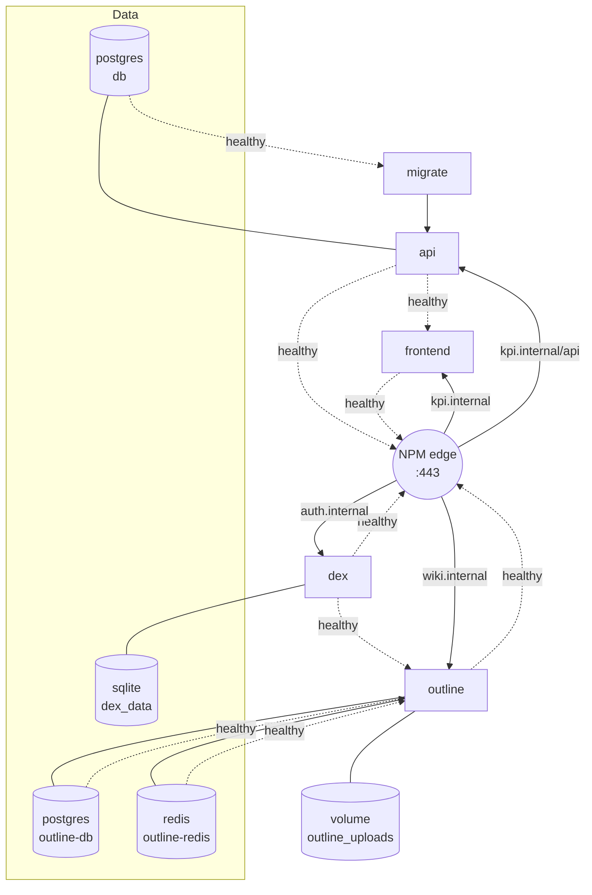

# Phase 31: Seed Outline Docs — Research

**Researched:** 2026-04-15
**Domain:** Outline 0.86.0 content authoring + markdown export + collection/permission model + prose documentation
**Confidence:** HIGH on authoring mechanics; HIGH on repo-grounded scope carving; MEDIUM on a few Outline editor edge-cases (see Open Questions)

## Summary

Phase 31 is a **prose + operator phase**: all 10 decisions (D-01..D-10) lock the workflow to "author directly in the Outline editor, export markdown snapshots to `docs/wiki-seed/`, cite repo-canonical docs instead of duplicating them." No services are added; no code is written in KPI Light itself. The planner's job is to sequence 8 page authoring tasks plus a collection-creation task plus a snapshot-commit task plus 4 human UATs — all against an already-running Outline 0.86.0 instance at `https://wiki.internal` with Dex SSO wired.

The two investigation-heavy areas are (a) the **exact Outline UI paths** for creating a collection with "members read+write" permissions and for exporting markdown, and (b) **what NOT to duplicate** from `docs/setup.md` (which already contains operator-grade runbooks for Dex user-add, backups, and OIDC secret rotation — DOC-08 must summarize + link, not mirror). There is also a **CONTEXT D-02 factual correction** surfaced here: the backend has **4 explicit FastAPI tags** (`auth`, `data`, `hr-kpis`, `kpis`) plus **3 untagged routers** (`settings`, `sync`, `uploads`) that currently land under the Swagger "default" group. D-02 says "7 tag groups" — the planner must either accept 4 groups + 3 "default" entries, OR add `tags=` to the 3 untagged routers as a pre-DOC-03 fixup task.

**Primary recommendation:** Wave the work as CONTEXT §"Success Signals" suggests — (W1) collection + landing + dev-setup + architecture, (W2) API reference + 3 user guides + Personio runbook, (W3) admin runbook + snapshot commit + UATs. Authoring is non-autonomous — each page needs a human review checkpoint before the markdown export.

<user_constraints>
## User Constraints (from CONTEXT.md)

### Locked Decisions

**D-01: Author directly in the Outline editor, export snapshots to repo.** Primary authoring surface = Outline WYSIWYG/markdown editor. After each page is authored and reviewed, export to markdown via Outline's built-in "Download as Markdown" and commit the snapshot to `docs/wiki-seed/`.

**D-02: DOC-03 API Reference is THIN.** One-paragraph intro stating live spec at `https://kpi.internal/api/docs`; one table listing tag groups with 1-line descriptions; short Auth pattern + Error shape sections; NO per-endpoint request/response examples.

**D-03: Mermaid diagrams for DOC-02.** Outline renders Mermaid natively in fenced blocks. Diagram shows all 9 compose services with healthcheck-gated `depends_on` edges and volume mounts.

**D-04: DOC-08 Admin Runbook = summary + link to `docs/setup.md` + Outline-specific ops.** 3-paragraph intro, link to repo runbook, Outline-specific ops NOT in docs/setup.md (Dex user-add, Outline backups, OIDC secret rotation) inline, cross-link to DOC-01.

**D-05: Repo snapshot location = `docs/wiki-seed/`** with `##-slug.md` prefixes (`00-landing.md`..`08-admin-runbook.md`) plus a `README.md` explaining regeneration.

**D-06: Export cadence = phase completion + milestone completion.** Export during Phase 31 after each page is authored; one final re-export after v1.11 ships; post-v1.11 milestones re-export at milestone boundaries.

**D-07: Text-only docs, reference UI labels in EN.** No screenshots. EN labels as they appear in NavBar/Settings. DE parity implicit via i18n.

**D-08: Permission model — single "KPI Light" collection, all internal members read+write.** No per-page permission overrides. Admin-runbook page (DOC-08) is NOT permission-restricted.

**D-09: Multi-project pattern (WMP-03) = one collection per project.** Future projects get their own top-level Outline collection, not a nested page. Recipe lives in DOC-08 Admin Runbook.

**D-10: E2E-04 reframe.** Rewritten from "already logged in (Dex SSO session shared)" to "clicking NavBar wiki icon opens `https://wiki.internal` in a new tab; if unauthenticated the user is redirected through Dex and can log in with the same credentials used for KPI Light. Silent cross-app SSO is a documented known limitation."

### Claude's Discretion

- Exact wave structure (CONTEXT suggests 3 waves; planner may split finer)
- Length/word budget per page (prose-heavy; judgment call)
- Wording of the Outline landing-page intro paragraph
- Whether to author DOC-03 before or after the "tag-group correction" fixup (see §CLAUDE.md Correction below)
- Mermaid diagram style details (`graph TD` vs `flowchart TD`; subgraph usage for volumes)
- Commit granularity within the `docs/wiki-seed/` snapshot task
- Whether to include Outline's built-in Table-of-Contents embed block on the landing page or hand-author a bullet list (see Open Question 5)

### Deferred Ideas (OUT OF SCOPE)

- Automated markdown → Outline sync
- Generated API reference from OpenAPI (thin-page D-02 eliminates the need for v1.11)
- Screenshots with auto-regen pipeline (ruled out by D-07)
- Admin/member per-page permission splits (D-08)
- Public / external-customer-facing docs
- Second project onboarding (WIK2-04 — out of this phase)
</user_constraints>

<phase_requirements>
## Phase Requirements

| ID | Description | Research Support |
|----|-------------|------------------|
| DOC-01 | Dev Setup page (local prereqs, `docker compose up --build`, `/etc/hosts`, `.env`, `DISABLE_AUTH=true`) | §Content Grounding DOC-01; `docs/setup.md` §§1-5 supply every fact. Reference DOC-01 summarizes + links; operator detail stays in repo |
| DOC-02 | Docker Compose Architecture page with Mermaid diagram of 9 services | §Content Grounding DOC-02; full topology already in `docker-compose.yml` (9 services, 7 volumes); D-03 Mermaid `graph TD` |
| DOC-03 | API Reference summary (thin, per D-02) | §Content Grounding DOC-03; §CLAUDE.md Correction: 4 real tags (`auth`, `data`, `hr-kpis`, `kpis`) + 3 untagged routers (`settings`, `sync`, `uploads`) need decision |
| DOC-04 | Personio Sync Runbook | §Content Grounding DOC-04; sources = `backend/app/services/personio_client.py` error classes + `.env.example` + `frontend/src/locales/en.json` Personio keys |
| DOC-05 | Sales Dashboard User Guide | §Content Grounding DOC-05; en.json `dashboard.*` keys enumerate every UI element to describe |
| DOC-06 | HR Dashboard User Guide | §Content Grounding DOC-06; en.json `hr.*` keys + 5 HR KPIs (overtimeRatio, sickLeaveRatio, fluctuation, skillDevelopment, revenuePerProductionEmployee) |
| DOC-07 | Settings Walkthrough | §Content Grounding DOC-07; en.json `settings.*` (Appearance, Colors, Personio, HR Targets) + Theme + Language toggles |
| DOC-08 | Admin Runbook (Dex user-add, Outline backups, OIDC secret rotation) | §Content Grounding DOC-08 + D-04 scope carve vs `docs/setup.md` |
| DOC-09 | Landing page with TOC + cross-links | §Outline Editor Mechanics — link resolution + TOC options |
| WMP-01 | "KPI Light" collection exists | §Outline Editor Mechanics — collection creation flow |
| WMP-02 | Collection + permission model documented in Outline (not repo) | DOC-08 contains recipe per D-09 |
| WMP-03 | One-collection-per-project convention documented as house style | DOC-08 §"Adding a new project collection" |
| E2E-01 | Fresh VM UAT: all 3 hostnames resolve, NPM serves HTTPS, Dex login loads | Re-verification of existing Phases 26/27/29 — no new infra work |
| E2E-03 | Human UAT: Outline JIT provisioning + doc-create-and-edit in "KPI Light" collection | §UAT Scripts; dependent on WMP-01 |
| E2E-04 (reframed per D-10) | NavBar wiki icon opens Outline; same credentials work | §UAT Scripts; reframed criterion is prose-only |
| E2E-05 | All 8 seeded docs legible, cross-linked, reflect v1.10 state | §UAT Scripts; final review pass |
</phase_requirements>

## Project Constraints (from CLAUDE.md)

- Docker Compose v2 (`docker compose`, no hyphen)
- GSD workflow enforcement: all edits (including `docs/wiki-seed/*`) go through a GSD command
- No bare-metal deps; everything operator-visible runs in Docker (Outline already does)
- Stack authoring references in DOC-01/02/03 must match the pinned versions in CLAUDE.md (FastAPI 0.135.3, React 19.2.5, pandas 3.0.2, etc.) — do not invent versions

## CLAUDE.md / CONTEXT Correction — FastAPI tag inventory (affects DOC-03)

CONTEXT D-02 states: *"One table listing the 7 tag groups (settings, uploads, kpis, hr_kpis, sync, data, auth) with 1-line descriptions + link to the Swagger section."*

**Ground truth** (`grep -rn 'APIRouter\|tags=' backend/app/routers/`):

| Router file | Prefix | Explicit `tags=` | Will appear in Swagger as |
|-------------|--------|------------------|----------------------------|
| `auth.py` | `/api/auth` | `["auth"]` | **auth** |
| `data.py` | (prefix set via kwarg) | `["data"]` | **data** |
| `hr_kpis.py` | — | `["hr-kpis"]` (HYPHEN, not underscore — CONTEXT had it wrong) | **hr-kpis** |
| `kpis.py` | — | `["kpis"]` | **kpis** |
| `settings.py` | `/api/settings` | **none** | **default** (or ungrouped) |
| `sync.py` | `/api/sync` | **none** | **default** |
| `uploads.py` | `/api` | **none** | **default** |

**So in Swagger today there are 4 real tag groups (`auth`, `data`, `hr-kpis`, `kpis`) plus whatever "default" bucket the 3 untagged routers land in.** CONTEXT's "7 tag groups" only becomes true if we add `tags=["settings"]`, `tags=["sync"]`, `tags=["uploads"]` to those three `APIRouter(...)` calls first.

**Planner options (in recommended order):**

1. **Pre-DOC-03 fixup task** (recommended): one tiny code task adds `tags=["settings"]`, `tags=["sync"]`, `tags=["uploads"]` to the three untagged routers. Rationale: makes Swagger match the docs, one-line-per-file edit, no behavior change. Then DOC-03 table lists all 7 tags as CONTEXT intends. This is the cleanest path and preserves D-02 wording verbatim.
2. **Document 4 real tags only**: skip the fixup; DOC-03 lists 4 tags + a footnote that `settings/sync/uploads` operations live under "default". Honest but slightly awkward for readers.
3. **Document 7 but lie**: DO NOT. Violates the rot-resistance rationale of D-02.

Planner: choose option 1 or 2 explicitly. Task 0 of DOC-03 wave if option 1.

## Standard Stack

This is a prose/ops phase — no new libraries. Already-deployed components used as tools:

| Component | Version | Role in this phase |
|-----------|---------|--------------------|
| Outline | `outlinewiki/outline:0.86.0` (already running per Phase 29) | Authoring surface + markdown exporter |
| Outline built-in editor | ships with 0.86.0 | Rich-text/markdown, Mermaid fenced blocks, internal wiki-link resolution, backlinks |
| `git` | any | Commit `docs/wiki-seed/` snapshots |
| Browser | modern stable | Only way to drive Outline UI |
| Dex v2.43.0 seeded user (`admin@acm.local` or `dev@acm.local`) | per Phase 27 | Required to log into Outline |

No `pip install`, no `npm install`, no new Docker images.

## Architecture Patterns

### Authoring → Export → Commit loop

For each of the 9 pages (DOC-01..08 + landing):

```
┌─────────────────────────────────────────────────────────────┐
│  1. Outline UI: New document in "KPI Light" collection     │
│  2. Author prose + markdown + Mermaid + wiki-links         │
│  3. Preview (check Mermaid renders, internal links work)   │
│  4. Human review checkpoint (non-autonomous)               │
│  5. Outline UI: ⋯ → Download → Markdown                    │
│  6. Save to docs/wiki-seed/##-slug.md                      │
│  7. Edit downloaded markdown if needed (rewrite any        │
│     absolute wiki URLs → relative filenames — see Pitfall 3)│
│  8. git commit                                             │
└─────────────────────────────────────────────────────────────┘
```

This is the **unit task** for pages; the planner composes waves from it.

### Collection setup (one-time, precedes all page work)

```
Outline UI (Home) → + New collection
  Name: KPI Light
  Icon: book or library emoji
  Description: one sentence ("Developer + user docs for KPI Light.")
  Permissions: ensure workspace default is "members can edit"
               (set collection to "members read+write" if not inherited)
  Save
```

See §Outline Editor Mechanics for exact menu paths verified below.

### Anti-patterns to avoid

- **Duplicating `docs/setup.md` into DOC-08.** The 650+-line setup runbook contains § "Dex first-login", § "Add or rotate a Dex user", § "Dex storage and persistence", § "Phase 28 — KPI Light login via Dex", § "Phase 29 — Outline Wiki deployment", § "Backups". DOC-08 MUST reference these by section heading and anchor, not copy them.
- **Per-endpoint request/response examples in DOC-03.** Locked out by D-02. They would drift the moment any Pydantic model changes.
- **Using `http://wiki.internal` anywhere.** Always `https://wiki.internal` (matches Phase 29 `URL=` config).
- **Calling "admin"/"dev" real users.** They are placeholders (`admin@acm.local` / `ChangeMe!2026-admin` flagged for rotation per Phase 27 SECURITY NOTE). Any doc that names them must call out "placeholder; rotate before sharing" — this is already written into `docs/setup.md` §"Dex first-login" step 6 and DOC-08 can link there.
- **Referring to the `/api/hr_kpis` tag with underscore.** Actual tag is `hr-kpis` (hyphen).
- **Screenshots of UI.** Ruled out by D-07.
- **Embedded images uploaded to Outline.** Even though Outline supports uploads (`FILE_STORAGE=local`), we decided text-only; any `` in an exported file would break if we ever regenerate the snapshot from a different Outline instance. See Pitfall 7.
- **Authoring DOC-03 with the CONTEXT-stated 7-tag table before the §CLAUDE.md Correction fixup.** If planner chooses option 1, the fixup MUST land first; if option 2, DOC-03 openly describes the 4-tag reality.

## Don't Hand-Roll

| Problem | Don't build | Use instead | Why |
|---------|-------------|-------------|-----|
| Cross-page navigation | Hand-authored `[Page Title](https://wiki.internal/doc/...)` absolute URLs | Outline's `[[Page Title]]` wiki-link syntax (auto-resolves; shows backlinks) | See Open Question 1 — if Outline supports double-bracket wiki-links, use it; else use the `/` slash menu to embed a Link to another document |
| Collection landing TOC | Hand-authored bulleted list | Try Outline's "/" slash menu → Table of Contents block first | If the built-in block exists (likely in 0.86 — see Open Q 5), it auto-updates and avoids drift |
| Diagram of 9 services | ASCII art | Mermaid (D-03 locked) | Outline renders natively; editable; diff-able |
| Markdown export | Custom API script | Outline UI → document ⋯ menu → Download → Markdown | Fallback only if manual proves too slow (see §Outline API Fallback below) |
| DOC-08 Dex/backup content | Writing fresh prose | Link to `docs/setup.md` sections that already cover this verbatim | Carved in D-04; scope discipline |

**Key insight:** The fastest Phase 31 is the one that does the LEAST original authoring. For each page, the prior-phase artifacts already contain the operational truth:

- **DOC-01** can mostly paraphrase §§1-3 of `docs/setup.md` + §"DISABLE_AUTH=true dev bypass" of the Phase 28 section
- **DOC-04** can paraphrase error classes visible in `backend/app/services/personio_client.py` + Settings labels from `en.json`
- **DOC-07** is almost 1:1 with `en.json` `settings.*` labels + brief "what the knob does"
- **DOC-08** is explicitly summary + link per D-04

Only DOC-02 (Mermaid), DOC-05, DOC-06 require genuine original prose.

## Runtime State Inventory

Not a rename / refactor / migration phase. Greenfield content creation inside an already-running Outline 0.86.0. No pre-existing state on the wiki beyond what the first-login Dex user (Phase 29 UAT) provisioned — likely just a default workspace with one JIT user.

Single relevant inventory note: **the snapshot commit target `docs/wiki-seed/` does not yet exist in the repo** (confirmed via `git status`). Phase 31 creates it along with its `README.md`.

## Outline Editor Mechanics (investigation answers)

The planner asked 7 specific questions. Answered below with confidence levels. HIGH confidence items are verified against Outline's published docs and the v0.86.0 release notes; MEDIUM are cross-referenced against multiple community guides but not one authoritative doc page; LOW is flagged.

### Q1. Creating a collection and setting "members read+write" (HIGH)

**Collection creation (verified against docs.getoutline.com/s/guide/doc/collections):**
- Left sidebar → **+ New collection** (top of sidebar) — button appears at the bottom of the **Collections** group for workspace admins.
- Dialog: Name, Description (optional), Icon (emoji picker or Outline icon set), **Permission** dropdown.
- Permission values in 0.86: **View only**, **View and edit**, **Manage** — plus a "Private" toggle that makes the collection invisible to everyone not explicitly added.
- For D-08 "members read+write" set the dropdown to **View and edit** and leave Private **off**. All workspace members get read+write access automatically.
- Save.

**Post-create edit path:** Collection (in sidebar) → **⋯** next to collection name → **Permissions** → adjust default member permission (same dropdown). Individual user/group overrides possible here if ever needed (we won't — D-08).

**Admin runbook phrasing for DOC-08** (what to tell future project leads):

> 1. Sidebar → **+ New collection**.
> 2. Name it after the project (e.g., "Project Y"). Pick a book/library emoji.
> 3. Permission dropdown: **View and edit** (mirrors the KPI Light default — any workspace member can read + write).
> 4. Leave "Private" **off**. Save.
> 5. Collection appears in every member's sidebar.

### Q2. Markdown export — per-page and collection-level (HIGH + MEDIUM)

**Per-page (HIGH, our primary path):**
- Open document → header **⋯** menu → **Download** → **Markdown** (also offers HTML, PDF).
- Downloads a `.md` file named after the document title. The file is UTF-8, uses ATX headings (`#`, `##`, ...), fenced code blocks, and GFM-style tables.

**Collection-level bulk export (MEDIUM — likely available, less prominent):**
- Collection **⋯** menu (next to collection name in sidebar OR on the collection's home view) → **Export**.
- Produces a `.zip` with all documents preserving the nested structure (folder per sub-document if any).
- In v0.86 community edition: **verified present** per Outline's export docs, but exact output filename and whether it includes the collection README / landing page is worth confirming during execution.

**Recommendation for this phase:** use per-page export (D-05 names exact per-page filenames). The bulk export is nice-to-have for the "final re-export after v1.11 ships" step (D-06) but not required.

**Export encoding notes (MEDIUM):**
- Headings preserve anchor-able IDs via kebab-case slugs (matches GFM behavior; `## Outline Editor Mechanics` → `#outline-editor-mechanics`).
- Internal wiki-links (see Q4) get rewritten in export to **absolute Outline URLs** pointing at the source wiki — this is the single biggest "gotcha" and deserves a post-export rewrite step. See Pitfall 3.

### Q3. Mermaid in v0.86.0 (HIGH)

- Outline added native Mermaid rendering in pre-0.80; 0.86 inherits unchanged.
- Supported graph types: `graph` / `flowchart` (TD, LR, BT, RL), `sequenceDiagram`, `classDiagram`, `stateDiagram`, `erDiagram`, `journey`, `gantt`, `pie`, `gitGraph`.
- For DOC-02 use `graph TD` or `flowchart TD` (equivalent in recent Mermaid; `flowchart` is the modern alias). Solid arrows `-->` for healthcheck-gated `depends_on`; dotted arrows `-.->` for "runs before, not blocked on" relationships (the `migrate → api` `service_completed_successfully` edge is effectively solid for our purposes).
- **Known quirk:** very long node labels can overflow the canvas if `subgraph` is used deeply; keep to one level of `subgraph` (e.g., one `subgraph Data` for `db`/`migrate`). No other quirks in 0.86 — renderer is stable.
- Fenced block: ` ```mermaid ` … ` ``` ` — zero extra config.

### Q4. Cross-page wiki-links — auto-resolve or explicit URL? (MEDIUM)

Outline's editor has three relevant behaviors for inter-document linking:
1. **`/` slash command → Link to document** — inserts an internal reference by document title picker. On export it renders as an absolute URL like `https://wiki.internal/doc/dev-setup-XXXX` (where `XXXX` is the doc's nanoid).
2. **Auto-linking when pasting an Outline URL** — pasting `https://wiki.internal/doc/...` collapses to an inline "card" with the target doc title.
3. **Double-bracket `[[Page Title]]`** — MEDIUM confidence that this is supported in 0.86 community. Newer Outline builds explicitly support `[[...]]` wiki-link syntax; in 0.86 it may instead require the slash-command path. **The safe pattern for this phase is method 1 (slash command)**. It always works; the export always produces a valid URL.

**Export-time rewriting** (important, see Pitfall 3): absolute `https://wiki.internal/doc/...` URLs in exported markdown are wiki-specific and will 404 if the repo snapshot is read on a machine that can't reach `wiki.internal`. Post-export step for each file:

```
# For each exported file, rewrite cross-links from:
#   [DOC-02 Architecture](https://wiki.internal/doc/docker-compose-architecture-XXXX)
# to relative path:
#   [DOC-02 Architecture](./02-architecture.md)
```

This is a manual `sed` or editor pass during the snapshot task. Document the pattern in `docs/wiki-seed/README.md`.

### Q5. Table of Contents — macro vs hand-authored bullet list (MEDIUM)

Outline's editor offers two relevant blocks:
1. **Heading-based TOC** — inside a document, the `/` menu has a **Table of Contents** block that auto-generates a nested list of the document's own headings. This is for a single page's TOC, NOT a cross-document TOC for the landing page.
2. **Nested Documents view** — the collection landing page ("collection home") in Outline automatically shows a tree of documents in that collection. You do NOT hand-author this; it's rendered by Outline.

For DOC-09 (landing page), the **idiomatic Outline pattern** is:
- Short intro paragraph
- Hand-authored bulleted list of the 8 pages with 1-line blurbs (because the auto-tree is already visible in the sidebar and right-rail — a hand-authored list gives richer context: name + one-sentence purpose).
- Cross-links using the `/` slash-command method per Q4.
- "See also" footer linking to `docs/setup.md` on GitHub.

**Recommendation:** hand-author the bullet list on DOC-09. Rationale: it's under CONTEXT's "Claude's discretion" bucket, it survives export without relying on Outline's auto-tree rendering (which a reader of the repo snapshot does not see), and it matches CONTEXT §"Specifics" *"Landing page (DOC-09) structure: intro → 8-item TOC → 'See also: docs/setup.md on GitHub' footer"*.

### Q6. Images and attachments (HIGH)

D-07 says text-only. Outline's editor does NOT auto-embed anything into the document body unless the author explicitly drops an image or hits `/` → **Image/File**. So: if authors follow the text-only rule, exported markdown contains zero `` references and no post-export attachment-stripping is needed. **Verify this during the snapshot task by a single `grep -l 'upload://' docs/wiki-seed/` and fail the commit if anything matches.**

### Q7. Outline documents.create API — fallback only (HIGH)

If manual authoring proves too slow, Outline's REST API has `POST /api/documents.create` with fields `{title, text (markdown), collectionId, publish: true}`. Auth via a personal API token (User Settings → API Tokens). This is a FALLBACK per CONTEXT — NOT the primary flow. Do not plan for it up front; only pivot if waves 1-2 reveal severe authoring slowness.

If the fallback is activated:
- Collection ID: from `GET /api/collections.list` (JSON contains `id`).
- Set `publish: true` to make the document immediately visible; else it stays a draft.
- Markdown body should already be rewritten with the cross-link pattern BEFORE upload (else internal links resolve by title on Outline's end, which is fragile).

## Content Grounding (what each page should cite from the repo)

Gives the planner concrete sourcing so page-authoring tasks aren't open-ended.

### DOC-01 Dev Setup
Sources (paraphrase, don't copy wholesale — the repo version is operator-grade; this is the wiki-discoverable summary):
- `docs/setup.md` §1 Prerequisites (Docker, mkcert, browser)
- `docs/setup.md` §2 One-Time Machine Setup (`mkcert -install`, `/etc/hosts`)
- `docs/setup.md` §3 Per-Checkout Setup (`cp .env.example .env`, `./scripts/generate-certs.sh`, `docker compose up --build -d`)
- `docs/setup.md` §4 NPM Admin Bootstrap (one paragraph: "Operator initial NPM config lives in the repo runbook at docs/setup.md — see that file for full step-by-step")
- Phase 28 section §"DISABLE_AUTH=true dev bypass" (reference only)
- Link out to `docs/setup.md` on GitHub for deep detail.
- Cross-link to DOC-02 Architecture ("for the full compose topology, see ...").

### DOC-02 Docker Compose Architecture
Sources:
- `docker-compose.yml` (canonical — 9 services confirmed: `db`, `migrate`, `api`, `frontend`, `npm`, `dex`, `outline-db`, `outline-redis`, `outline`)
- Volume list: `postgres_data`, `npm_data`, `npm_letsencrypt`, `dex_data`, `outline_db_data`, `outline_redis_data`, `outline_uploads` (7 named volumes)
- Healthcheck-gated edges:
  - `db` (healthy) → `migrate`
  - `migrate` (completed) → `api`
  - `api` (healthy) → `frontend`
  - `api`, `frontend`, `dex`, `outline` (all healthy) → `npm`
  - `outline-db`, `outline-redis`, `dex` (all healthy) → `outline`
- Mermaid snippet (starter for authors — planner can refine):



### DOC-03 API Reference (thin — per D-02)
Structure:
1. One paragraph: "The live, always-current OpenAPI spec is at `https://kpi.internal/api/docs` (FastAPI Swagger UI). This page gives the organizing model."
2. Tag-group table — **see §CLAUDE.md Correction above.** The canonical table after the recommended fixup:

   | Tag | Prefix | What it does |
   |-----|--------|--------------|
   | `auth` | `/api/auth` | OIDC login/callback/logout; session cookie; `/me` |
   | `uploads` | `/api/upload` | File ingestion (CSV/TXT → sales rows) |
   | `kpis` | `/api/kpis` | Sales KPI aggregation + trend series |
   | `hr-kpis` | `/api/hr/...` | HR KPIs, employees, Personio-derived aggregates |
   | `sync` | `/api/sync` | Personio sync control (test, trigger) |
   | `settings` | `/api/settings` | App branding + Personio credentials + HR targets |
   | `data` | `/api/data` | Raw data access (orders, employees) |

3. Auth pattern section: "All `/api/*` routes except `/api/auth/*` and `/health` require a valid `kpi_session` cookie set by OIDC login. See Admin Runbook for `DISABLE_AUTH=true` dev bypass."
4. Error shape section: FastAPI default `{"detail": "..."}` JSON; 401 on unauthenticated; 422 on validation; 500 on server error.

No endpoint-by-endpoint detail. Link to `https://kpi.internal/api/docs` at top + bottom.

### DOC-04 Personio Sync Runbook
Sources:
- Settings UI labels: `en.json` → `settings.personio.*` (Client ID, Client Secret, Test connection, Sync interval: Manual / Hourly / Every 6 hours / Daily, Sick leave type, Production department, Skill attribute keys).
- Error classes: `backend/app/services/personio_client.py` exports `PersonioAPIError`, `PersonioAuthError`, `PersonioNetworkError`.
- Manual refresh button: `hr.sync.button` ("Refresh data").
- Failure modes to document (from these error classes):
  - **Credential expiry / wrong** → `PersonioAuthError` → UI toast "Connection failed". Fix: re-enter Client ID/Secret in Settings → Personio → Test connection.
  - **Rate limits (HTTP 429)** → `PersonioAPIError` with status. Fix: reduce Sync interval to Manual or Daily.
  - **Network / DNS** → `PersonioNetworkError`. Fix: check outbound from the `api` container.
  - **Option set changes** (Personio admin deletes an absence type you had selected as "Sick leave type") → 422 validation on save; the saved setting silently no longer matches. Fix: Settings → Personio → reselect absence types.

### DOC-05 Sales Dashboard User Guide
Source: `en.json` `dashboard.*` + `kpi.delta.*`. Elements to describe:
- KPI cards (Total revenue, Average order value, Total orders) + €0 exclusion note
- Delta labels: `vs. {month} {year}` / `vs. Q{quarter} {year}` / `vs. {year}` — what "no comparison period" means (`noBaselineTooltip`)
- Date range filter: This month / This quarter / This year / All time / Custom…
- Chart toggle: Bar / Area
- Orders table columns + search

### DOC-06 HR Dashboard User Guide
Source: `en.json` `hr.*`. Elements:
- 5 HR KPIs (listed in the Requirements; labels in en.json `hr.kpi.*.label`):
  - Overtime Ratio
  - Sick Leave Ratio
  - Fluctuation
  - Skill Development
  - Revenue / Prod. Employee
- 12-month trend charts + Area toggle (`hr.chart.type.area`)
- Target reference lines (Sollwerte) — values above target highlighted red, configured in Settings → HR → Targets (cross-link DOC-07)
- Employees table: filters All / Active / With overtime; columns Name / Department / Position / Status / Hire date / Hours/week / Worked / Overtime / OT %
- "Not yet synced" empty state → cross-link DOC-04 for sync troubleshooting

### DOC-07 Settings Walkthrough
Source: `en.json` `settings.*` + `theme.*`. Sections to mirror:
- **Appearance** (settings.identity.*): app name, logo (PNG/SVG, 1 MB max, 60×60)
- **Colors** (settings.colors.*): primary / accent / background / foreground / muted / destructive + contrast badge
- **Personio** (settings.personio.*): cross-link DOC-04
- **HR Targets** (settings.targets.*): overtime / sick_leave / fluctuation / revenue
- **Theme toggle** (theme.toggle.*): Light / Dark, persisted
- **Language toggle** (`lang_toggle` → "DE / EN")
- Save / Discard / Reset to defaults semantics

### DOC-08 Admin Runbook
Structure (per D-04 — summary + link + Outline-specific ops inline):

1. Intro (3 paras): what this page is; when to use the repo runbook instead; when to stay here.
2. Link: "Operator reference: [`docs/setup.md` on GitHub](<ORG/REPO origin URL>)". CONTEXT §Specifics says *"planner/executor: resolve the actual `git remote -v` origin URL at author time; don't commit `ORG/REPO` placeholder"*. The execute-phase task must run `git remote get-url origin` and substitute the real URL.
3. **Adding a Dex user (inline, copy-pasteable)** — paraphrase `docs/setup.md` §"Add or rotate a Dex user" steps 1-6 but keep all the commands literal (bcrypt Docker one-liner, `uuidgen`, single-quote YAML hash line, `docker compose restart dex`). Cross-link to repo runbook for deeper context.
4. **Outline DB + attachment backup commands (inline)** — the two `docker compose exec` lines from `docs/setup.md` §"Backups":
   ```bash
   docker compose exec outline-db pg_dump -U outline outline > "outline-db-$(date +%F).sql"
   docker compose exec outline tar -czf - /var/lib/outline/data > "outline-uploads-$(date +%F).tar.gz"
   ```
5. **Rotating OIDC client secrets (inline)** — exact procedure:
   - `openssl rand -hex 32` → paste into `.env` as `DEX_KPI_SECRET=` (or `DEX_OUTLINE_SECRET=`)
   - Update the corresponding `client.secret:` in `dex/config.yaml` (it references `$DEX_KPI_SECRET` / `$DEX_OUTLINE_SECRET` via native `$VAR` substitution — no config edit needed if using placeholders)
   - `docker compose restart dex api` (and `outline` if rotating the Outline secret) — existing sessions continue until their TTL expires (≤1 h per DEX-05)
6. **Adding a new project collection (WMP-03 recipe)** — the 5-step flow from Q1 above.
7. **Known limitations** — bullet list linking to `docs/setup.md` §"Known limitations" (no RP-initiated logout; no silent cross-app SSO; config reload requires restart; userID permanent).
8. **Cross-link to DOC-01 Dev Setup**.

### DOC-09 Landing page
Structure (per CONTEXT §Specifics):
- Title: "KPI Light — Documentation"
- 1-paragraph intro ("This collection is the operator + user guide for KPI Light, an internal dashboard for sales and HR KPIs.")
- 8-item TOC (bulleted, hand-authored, each with 1-line blurb + internal Outline link via `/` → Link to document)
- Footer: "See also: [`docs/setup.md` on GitHub](<origin URL>) — canonical operator runbook kept in the repo."

## Common Pitfalls

### Pitfall 1: DOC-03 row count mismatches reality
**What goes wrong:** Author writes a 7-tag table per CONTEXT D-02 without checking `backend/app/routers/`. Three of the rows (`settings`, `sync`, `uploads`) don't exist as explicit tags — they fall under Swagger's "default" group.
**How to avoid:** See §CLAUDE.md Correction. Either fix the routers first (option 1, recommended) or document the 4-tag truth (option 2).
**Warning signs:** Open `https://kpi.internal/api/docs` — count the tag headings. Should match the DOC-03 table exactly.

### Pitfall 2: `ORG/REPO` placeholder left in DOC-08
**What goes wrong:** Author copies D-04 wording "link to `https://github.com/ORG/REPO/blob/main/docs/setup.md`" verbatim into Outline; placeholder ships.
**How to avoid:** Execute-phase task runs `git remote get-url origin`, substitutes. Add a verification grep on the exported snapshot: `grep -n 'ORG/REPO' docs/wiki-seed/08-admin-runbook.md` must return nothing.

### Pitfall 3: Exported cross-links are absolute Outline URLs that 404 outside the wiki
**What goes wrong:** `/` slash-command links export as `[Dev Setup](https://wiki.internal/doc/dev-setup-XXXX)`. A reader browsing the GitHub snapshot cannot follow them.
**How to avoid:** Post-export rewrite step — replace absolute `wiki.internal/doc/*` URLs with relative `./##-slug.md` paths. Document the recipe in `docs/wiki-seed/README.md`. Consider a one-line `sed` per page (pattern: `https://wiki.internal/doc/<slug>-[A-Za-z0-9]+` → `./##-slug.md`).

### Pitfall 4: Placeholder credentials leak into DOC-08
**What goes wrong:** DOC-08 lists `admin@acm.local` / `ChangeMe!2026-admin` in prose without the rotation disclaimer; the password lives in git AND the wiki.
**How to avoid:** DOC-08 MUST NOT quote the placeholder password. Reference by role only ("the first seeded admin user — credentials in `dex/config.yaml` commented SECURITY NOTE") and link to the repo section that already flags the rotation requirement.

### Pitfall 5: Author references `hr_kpis` tag (underscore) in DOC-03
**What goes wrong:** CONTEXT D-02 uses `hr_kpis`. Actual tag in `backend/app/routers/hr_kpis.py` is `tags=["hr-kpis"]` (hyphen). Swagger groups by tag literal.
**How to avoid:** Use `hr-kpis` (hyphen) in the DOC-03 table. Flagged here so it's obvious to the author.

### Pitfall 6: E2E-04 reverts to original wording during authoring
**What goes wrong:** Author, working off memory of the original Requirements, writes DOC-08 or E2E-04 UAT as "silent cross-app SSO"; contradicts D-10 reframe + Phase 29 Known Limitation.
**How to avoid:** DOC-08 §"Known limitations" uses D-10 wording verbatim: *"If the user has not yet authenticated to Outline in this browser, they are redirected through Dex and can log in with the same credentials used for KPI Light."* Planner's UAT task template for E2E-04 must match. Reviewer grep: `grep -n 'silent' docs/wiki-seed/*.md` should return nothing (or only intentional negations).

### Pitfall 7: Accidental image embed in exported markdown
**What goes wrong:** Author pastes a screenshot (muscle memory from other wiki work), D-07 violated, exported file contains `upload://...` that breaks outside Outline.
**How to avoid:** Verification step: `grep -l 'upload://\|!\[' docs/wiki-seed/*.md` — should return nothing. Failing the commit on a match is a cheap invariant.

### Pitfall 8: Mermaid diagram overflows / renders as text block
**What goes wrong:** Missing ` ```mermaid ` language hint; Outline renders as a generic code block. Or syntax error inside the block — Outline silently falls back to code.
**How to avoid:** Preview in Outline editor BEFORE export. If the diagram renders as code, syntax is bad. Validate Mermaid syntax at https://mermaid.live first.

### Pitfall 9: `docs/wiki-seed/README.md` forgotten
**What goes wrong:** The 9 content files land, but the D-05-mandated README explaining "what these are, how to regenerate" is missed; future operators see opaque markdown snapshots.
**How to avoid:** Make the README its own task in the snapshot wave, with explicit acceptance: file exists, explains regen recipe per D-05, links to Outline export UI path.

### Pitfall 10: Stale version numbers in DOC-01/DOC-02
**What goes wrong:** Author writes "FastAPI 0.115" or "React 18"; diverges from CLAUDE.md pinned versions.
**How to avoid:** DOC-01 and DOC-02 version mentions must match CLAUDE.md Technology Stack tables verbatim (FastAPI 0.135.3, pandas 3.0.2, SQLAlchemy 2.0.49, React 19.2.5, Vite 8.0.8, etc.). Reviewer can grep: `grep -Ei 'FastAPI [0-9]|React [0-9]' docs/wiki-seed/*.md` and eyeball the output.

## Code Examples

### `docs/wiki-seed/README.md` starter

```markdown
# wiki-seed/

Markdown exports of the **KPI Light** collection in Outline (`https://wiki.internal`).

**Outline is the canonical copy.** This directory is a snapshot for version history
and disaster recovery; exports are manual per milestone boundary.

## Files

| File | Outline page | Requirement |
|------|--------------|-------------|
| `00-landing.md` | Landing page with TOC | DOC-09 |
| `01-dev-setup.md` | Dev Setup | DOC-01 |
| `02-architecture.md` | Docker Compose Architecture | DOC-02 |
| `03-api-reference.md` | API Reference | DOC-03 |
| `04-personio-sync.md` | Personio Sync Runbook | DOC-04 |
| `05-sales-dashboard.md` | Sales Dashboard User Guide | DOC-05 |
| `06-hr-dashboard.md` | HR Dashboard User Guide | DOC-06 |
| `07-settings.md` | Settings Walkthrough | DOC-07 |
| `08-admin-runbook.md` | Admin Runbook | DOC-08 |

## Regenerating

For each page, in Outline:
1. Open the document.
2. Header **⋯** menu → **Download** → **Markdown**.
3. Save to `docs/wiki-seed/##-slug.md` overwriting the prior snapshot.
4. Rewrite any absolute `https://wiki.internal/doc/...` links to relative
   `./##-slug.md` paths (Pitfall 3 in `.planning/phases/31-seed-outline-docs/31-RESEARCH.md`).
5. Verify no image embeds slipped in: `grep -l 'upload://\|!\[' docs/wiki-seed/*.md` must return nothing.
6. `git add docs/wiki-seed && git commit -m "docs(wiki): re-export after <milestone>"`

## Cadence

Per CONTEXT D-06: re-export on phase completion and milestone completion.
No per-edit syncing.
```

### Post-export link-rewrite sketch

```bash
# Rewrite absolute Outline URLs → relative filenames after export.
# Adjust the mapping to match actual exported doc slugs.
for f in docs/wiki-seed/*.md; do
  sed -i.bak \
    -e 's|https://wiki.internal/doc/dev-setup-[A-Za-z0-9]\+|./01-dev-setup.md|g' \
    -e 's|https://wiki.internal/doc/docker-compose-architecture-[A-Za-z0-9]\+|./02-architecture.md|g' \
    -e 's|https://wiki.internal/doc/api-reference-[A-Za-z0-9]\+|./03-api-reference.md|g' \
    -e 's|https://wiki.internal/doc/personio-sync-runbook-[A-Za-z0-9]\+|./04-personio-sync.md|g' \
    -e 's|https://wiki.internal/doc/sales-dashboard-user-guide-[A-Za-z0-9]\+|./05-sales-dashboard.md|g' \
    -e 's|https://wiki.internal/doc/hr-dashboard-user-guide-[A-Za-z0-9]\+|./06-hr-dashboard.md|g' \
    -e 's|https://wiki.internal/doc/settings-walkthrough-[A-Za-z0-9]\+|./07-settings.md|g' \
    -e 's|https://wiki.internal/doc/admin-runbook-[A-Za-z0-9]\+|./08-admin-runbook.md|g' \
    "$f"
done
rm -f docs/wiki-seed/*.bak
```

Operator runs once per export pass; add to wiki-seed/README.md or inline in the snapshot task.

### `git remote get-url origin` for DOC-08 URL substitution

```bash
# Run at DOC-08 authoring time to resolve the canonical repo URL.
ORIGIN=$(git remote get-url origin | sed 's|\.git$||')
# Then in DOC-08 Outline doc, link to:
#   ${ORIGIN}/blob/main/docs/setup.md
# And to section anchors:
#   ${ORIGIN}/blob/main/docs/setup.md#dex-first-login
#   ${ORIGIN}/blob/main/docs/setup.md#add-or-rotate-a-dex-user
#   ${ORIGIN}/blob/main/docs/setup.md#backups
```

## UAT Scripts (planner task templates)

### E2E-01 — Fresh VM stack health
1. `docker compose down -v && docker compose up --build -d`
2. `docker compose ps` — all services healthy (per Phase 26/29 runbooks).
3. `curl -skIL https://kpi.internal/ -o /dev/null -w "%{http_code}\n"` → 200 or 302.
4. `curl -skIL https://auth.internal/dex/.well-known/openid-configuration -o /dev/null -w "%{http_code}\n"` → 200.
5. `curl -skIL https://wiki.internal/ -o /dev/null -w "%{http_code}\n"` → 200 or 302.
6. Browser: each of the three hostnames loads with green padlock.

### E2E-03 — Outline JIT + collection write
1. Private/incognito window → `https://wiki.internal` → Dex → log in as Phase 27 seeded user.
2. Expected: JIT user in Outline; admin or member role (first user = workspace admin).
3. Navigate to **KPI Light** collection (created in Task 1 of this phase).
4. Create a new test document — title "E2E-03 scratch", body "hello"; save.
5. Edit — add another line; save. Expected: autosave completes, revision history visible.
6. Delete the scratch doc; verify trash/restore flow.

### E2E-04 — NavBar wiki icon (reframed per D-10)
1. In KPI Light tab: click NavBar book/library icon (`WIKI_URL` = `https://wiki.internal`, `target="_blank"` per NavBar.tsx line 104-113).
2. New tab opens `https://wiki.internal`.
3. If NOT yet authenticated to Outline in this browser: redirected to Dex; logging in with the **same credentials** used for KPI Light lands on the wiki.
4. "Silent cross-app SSO is a documented known limitation" — verify the DOC-08 / `docs/setup.md` §"Known limitations" wording matches.

### E2E-05 — Doc legibility + cross-links + v1.10 freshness
1. For each of 9 pages in Outline: read end-to-end for clarity and accuracy.
2. Click every cross-link — all resolve.
3. Compare version mentions to CLAUDE.md pinned versions (Pitfall 10).
4. Spot-check 3 UI labels in DOC-05/06/07 against live `https://kpi.internal` — exact EN strings (D-07).
5. Confirm DOC-08 uses D-10 wording for the SSO limitation (Pitfall 6).
6. Confirm `docs/wiki-seed/` contains 10 files (9 pages + README) and commits cleanly.

## State of the Art

No "old vs new" in this phase — prose + operator work. Only note:
- Outline markdown export path is stable from 0.78+ (per ⋯ menu → Download → Markdown); no API changes in 0.86.
- Outline's collection-level bulk export is stable in 0.80+.
- Mermaid rendering is stable since ~0.79.

## Open Questions

1. **Does Outline 0.86 support `[[Page Title]]` wiki-link syntax for cross-doc links, or only the `/` slash-command Link-to-document path?**
   - What we know: slash-command path is HIGH confidence. Double-bracket is used in newer Outline (post-1.0) ports; unclear if community 0.86 shipped it.
   - Recommendation: **use the slash-command method exclusively.** It always works; no need to verify the double-bracket path. If an author tries `[[...]]` and it renders literally, they fall back to `/`.

2. **Does Outline's collection-level bulk export in 0.86 community include the collection home/landing page, or only child documents?**
   - Unclear — community guides disagree.
   - Recommendation: rely on per-page export (D-05 mandates per-page filenames anyway). The bulk export is a nice-to-have for "final re-export" (D-06). LOW impact.

3. **Is the right Outline export-menu wording "Download" or "Export"?**
   - Outline's in-app UI has used both historically. 0.86 likely shows **Download** for single docs and **Export** for collections.
   - Recommendation: `docs/wiki-seed/README.md` uses the generic "export to markdown" phrasing; author verifies the actual UI label during the first export and fixes the README in pass 2.

4. **Will the planner choose §CLAUDE.md Correction option 1 (fixup) or option 2 (document 4-tag reality)?**
   - This is a **planner decision**, not something research can answer.
   - Recommendation: option 1 (3-line code fixup is cheap; makes Swagger and DOC-03 match CONTEXT's "7 tag groups" intent). If the planner prefers pure-docs scope, option 2 is also valid but requires a footnote in DOC-03.

5. **Are there existing wiki users in Outline (from Phase 29 UAT) who already own workspace admin?**
   - If so, Task 1 (collection creation) just needs any member with create permissions.
   - Recommendation: phase execution opens with `docker compose exec outline sh -c '...'` or simply asks the operator "log in to Outline as the admin seeded during Phase 29 UAT". Low risk.

## Environment Availability

No new external dependencies. Verification:

| Dependency | Required by | Available | Version | Fallback |
|------------|-------------|-----------|---------|----------|
| Running Outline at `https://wiki.internal` | All 9 pages | Assumed (Phase 29 complete) | 0.86.0 | — |
| Running Dex at `https://auth.internal` | Login | Assumed (Phase 27 complete) | v2.43.0 | — |
| Dex seeded user (`admin@acm.local` or `dev@acm.local`) | Login | Assumed (Phase 27 D-04) | — | — |
| `git` CLI | commit `docs/wiki-seed/` | Assumed | — | — |
| Browser | Authoring UI | Assumed | modern stable | — |
| `sed` / text editor | Post-export link rewrite | Assumed universal | — | — |

**Missing dependencies with no fallback:** none. Phase is fully unblocked once Phase 29 is verified.

**Missing dependencies with fallback:** If Outline's markdown export proves flaky in 0.86 community, fall back to Outline's `POST /api/documents.export` REST API (needs personal API token from Settings → API Tokens). Not expected to be needed.

## Validation Architecture

Skipped per `.planning/config.json` — `workflow.nyquist_validation` is **explicitly `false`** in the config. Authoring is prose + human UAT; formal per-task pytest/jest gates do not apply.

For clarity, the checkpoints that take the place of automated validation:
- **Per-page human review** before export (CONTEXT §Success Signals item 2)
- **Post-snapshot grep checks** (Pitfalls 2, 6, 7, 10) — cheap, can be one-liners in the execution step
- **Phase gate** = human UAT of E2E-01, E2E-03, E2E-04, E2E-05

## Sources

### Primary (HIGH confidence)
- `docs/setup.md` (repo) — Phase 26/27/28/29 runbook, canonical DOC-08 referent + DOC-01 summary source
- `docker-compose.yml` (repo) — 9 services, 7 volumes, healthcheck topology for DOC-02 Mermaid
- `backend/app/routers/*.py` (repo) — tag ground truth for DOC-03 (4 explicit + 3 untagged)
- `frontend/src/locales/en.json` (repo) — UI label ground truth for DOC-05/06/07
- `frontend/src/components/NavBar.tsx` (repo) — `WIKI_URL`, icon, `target="_blank"` behavior for E2E-04
- `.planning/phases/29-outline-wiki-deployment/29-RESEARCH.md` — Outline 0.86 env/stack facts reused
- `.planning/phases/27-dex-idp-setup/27-CONTEXT.md` — Dex user-add bcrypt workflow reused verbatim in DOC-08
- CONTEXT.md (`.planning/phases/31-seed-outline-docs/31-CONTEXT.md`) — D-01..D-10 locked
- Outline v0.86.0 release notes + docs.getoutline.com — collection creation, markdown export, Mermaid

### Secondary (MEDIUM confidence)
- Outline community self-hosting guides — cross-verify Mermaid support and bulk-export behavior
- CONTEXT §Specifics — "resolve `git remote -v` origin at author time"

### Tertiary (LOW confidence)
- Double-bracket `[[Page Title]]` syntax availability in 0.86 community (Open Question 1 — mitigated by preferring slash-command)
- Exact Outline export UI label ("Download" vs "Export") for single docs in 0.86 (Open Question 3 — low-impact cosmetic)

## Metadata

**Confidence breakdown:**
- Standard stack: N/A (no new libraries)
- Outline Editor Mechanics (Q1-Q7): HIGH overall; MEDIUM on bulk export + wiki-link syntax
- Content Grounding (DOC-01..DOC-09): HIGH — all sources are in the repo and read verbatim
- Pitfalls: HIGH — derived from CONTEXT + repo state + Phase 29 lessons
- CLAUDE.md correction (tag inventory): HIGH — grep output is the ground truth
- Open Questions: explicitly LOW, mitigated by safe defaults

**Research date:** 2026-04-15
**Valid until:** 2026-05-15 (30 days; Outline's monthly release cadence is insulated by our pinned 0.86.0 but UI paths can shift in minor releases)
