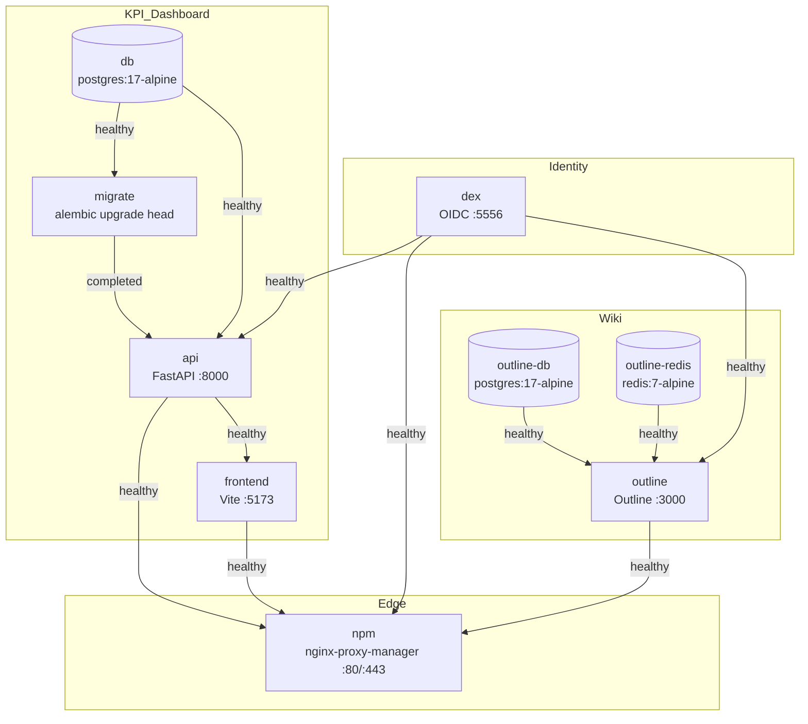

# Docker Compose Architecture

The stack is 9 services orchestrated by a single `docker-compose.yml`. Every edge below is gated by `depends_on: condition: service_healthy` — services only start once their dependencies have passed their healthchecks.

## Service topology

## Named volumes

| Volume | Mounted by | Purpose |
| --- | --- | --- |
| `postgres_data` | `db` | KPI Dashboard app data |
| `dex_data` | `dex` | Dex SQLite (`/data/dex.db`) for auth codes + refresh tokens |
| `outline_db_data` | `outline-db` | Outline wiki database |
| `outline_redis_data` | `outline-redis` | Outline cache persistence |
| `outline_uploads` | `outline` | Outline attachment file storage (`FILE_STORAGE=local`) |
| `npm_data` | `npm` | NPM admin settings + proxy host config |
| `npm_letsencrypt` | `npm` | Reserved for future Let's Encrypt migration (v2) |

## Networking

A single default bridge network connects every service; no custom networks. Services talk to each other by service name (`db`, `dex`, `outline-redis`, etc.). NPM is the only edge: ports `80`, `443` (TLS), `81` (admin UI) bound to the host; `:80`/`:443` are the only non-admin public surfaces.

The three public hostnames all resolve to `127.0.0.1` via `/etc/hosts`, terminate TLS at NPM (self-signed mkcert wildcard), and route to upstream services:

- `https://kpi.internal` → `frontend:5173` (root), `api:8000` (`/api/*`)
- `https://wiki.internal` → `outline:3000`
- `https://auth.internal` → `dex:5556`

## Key decisions

- **Pinned image tags everywhere** — `postgres:17-alpine`, `redis:7-alpine`, `ghcr.io/dexidp/dex:v2.43.0`, `outlinewiki/outline:0.86.0`, `jc21/nginx-proxy-manager:2.11.3`. Never `latest`.
- **Outline migrations auto-run at container start** — unlike KPI Dashboard, which uses a dedicated `migrate` compose service.
- **Dex config uses `envsubst` preprocessing** — client secrets live in `.env`, expanded via `envsubst < config.yaml > /tmp/config.yaml` at Dex container start. Dex v2.43 does not expand `${VAR}` in `staticClients.secret`.
- **Single compose file for dev and single-VM prod** — no split `docker-compose.dev.yml`. `DISABLE_AUTH=true` is the escape hatch for pure-frontend iteration without Dex.
